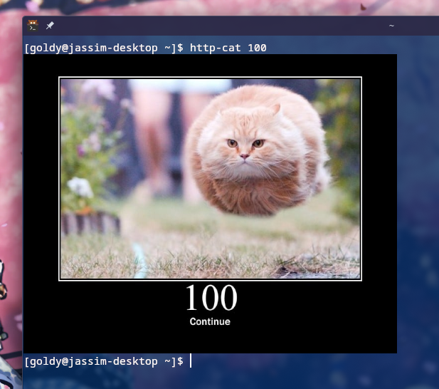

<div align="center">

  # 🐱 http-cat-cli

  <sub>HTTP kitty cats from the comfort of your terminal!</sub>

  

</div>

## The Problem
I was working on the backend of a web project of mine and I forgot what the HTTP status code `418` was, so instead of opening a web browser I of course used this as an excuse to write my very first golang project.

turns out I was getting trolled...


anyways now I can get these hypertext transfer protocol kitties right from a terminal ⛱️ ☺️

## How to install from soruce.
> [!WARNING]
> Currently only added Linux support as I'm too lazy rn 😪 😴

### Required Prerequisites
- [golang](https://go.dev/)
- [chafa](https://github.com/hpjansson/chafa) (used for image displaying)

1. Clone and cd into the repo.
```sh
git clone https://github.com/THEGOLDENPRO/http-cat-cli
cd http-cat-cli
```
2. Build the Go project.
```sh
make
```
3. Install the binary.
```sh
make install
```
4. Done ✨
```sh
http-cat 100
```


## Powered by the HTTP Cats API 🌟
The command line interface is brought to you by **https://http.cat/**.

Of course I am not affiliated with them...

> Section 1: Meow Disclaimer Meow
> 
> WHEREAS, it has come to the attention of the undersigned party, hereto referred to as "The Unaffiliated Entity," that there exists an entity, website, or digital repository of feline-themed HTTP status codes known to the general public and the World > Wide Web as "https://http.cat" (hereinafter referred to as "HTTP.cat" or "The Cat Site");
> 
> AND WHEREAS, there may exist, either now or in the conceivable future, confusion, misapprehension, mistaken identity, or any erroneous belief among any person, corporation, entity, being (human, feline, or otherwise), or legal personage that The > > > Unaffiliated Entity has any connection, affiliation, partnership, agreement, or even a casual acquaintance with HTTP.cat;
> 
> NOW, THEREFORE, The Unaffiliated Entity does hereby state, declare, pronounce, and affirm the following:
> 
> Section 2: Definitive Statement of Non-Affiliation
> 
> 2.1 The Unaffiliated Entity, which for the purposes of this document is identified as the person, being, entity, or conglomerate of legally cognizable existence who is reading, writing, drafting, contemplating, or thinking about this document, is unequivocally, undeniably, and irrefutably NOT affiliated, associated, allied, in league with, or remotely connected to HTTP.cat. Meow.
> 
> 2.2 The Unaffiliated Entity has not, at any point in time, been involved in the creation, design, maintenance, or humorous captioning of any content, imagery, or data found on HTTP.cat. Meow meow.
> 
> 2.3 The Unaffiliated Entity does not, nor has ever, received compensation, payment, wages, barter, trade, gift, donation, alms, or any form of remuneration, whether monetary or in the form of adorable cat memes, from HTTP.cat, its agents, subsidiaries, or feline overlords. Meow.
> 
> Section 3: Further Clarifications on Non-Affiliation
> 
> 3.1 The Unaffiliated Entity does not possess, own, hold title to, or have any proprietary interest in any domain names, trademarks, copyrights, or patents associated with HTTP.cat. Meow.
> 
> 3.2 The Unaffiliated Entity does not claim to know the person or persons, human or feline, responsible for the creation of HTTP.cat and has not engaged in conversation, correspondence, telepathy, or any form of communication with the creators, maintainers, or feline subjects of HTTP.cat. Meow meow.
> 
> 3.3 The Unaffiliated Entity has not, under any circumstances, past, present, or future, contributed content, feedback, code, commentary, suggestions, ideas, intellectual property, or even a random meow in the general direction of HTTP.cat. Meow.
> 
> Section 4: Hypothetical Situations in Which Non-Affiliation is Maintained
> 
> 4.1 In the event that The Unaffiliated Entity inadvertently encounters HTTP.cat during routine web browsing activities, whether by accident or deliberate navigation, such encounter shall not constitute an affiliation, partnership, or even an implied nod of approval. Meow.
> 
> 4.2 Should The Unaffiliated Entity find humor, amusement, or any other positive emotion upon viewing the feline-themed HTTP status codes on HTTP.cat, such feelings are entirely personal and do not create, imply, or establish a connection, relationship, or alignment of interests with HTTP.cat. Meow.
> 
> 4.3 In the unlikely event that The Unaffiliated Entity's likeness, name, pseudonym, or cat photo appears on HTTP.cat, such appearance is purely coincidental, unauthorized, and shall not be construed as an endorsement, collaboration, or affiliation of any kind. Meow meow.
> 
> Section 5: Disclaimers and Non-Waiver of Rights
> 
> 5.1 This document, in its entirety, including but not limited to its verbose language, humorous tone, and excessive length, shall not be construed as a waiver of The Unaffiliated Entity's rights to further disavow any potential or imagined affiliations with HTTP.cat in the future. Meow.
> 
> 5.2 The Unaffiliated Entity retains the right to continue using the internet, browsing cat memes, and accessing HTTP status codes without fear of creating any unintended affiliation with HTTP.cat. Meow.
> 
> Section 6: Conclusion and Final Affirmation of Non-Affiliation
> 
> IN WITNESS WHEREOF, the Unaffiliated Entity does hereby certify, swear, assert, and solemnly declare, with a straight face and a slight chuckle, that there exists no affiliation, association, connection, or relationship, implied or otherwise, between > The Unaffiliated Entity and HTTP.cat. Meow.
> 
> This document is effective immediately and shall remain in force for as long as the internet exists, or until the day cats rule the world, whichever comes first. Meow.
> 
> Signed,
> The Unaffiliated Entity (a.k.a. Kitty Cat ~nyan)
> 
> Date: 18/08/2024
